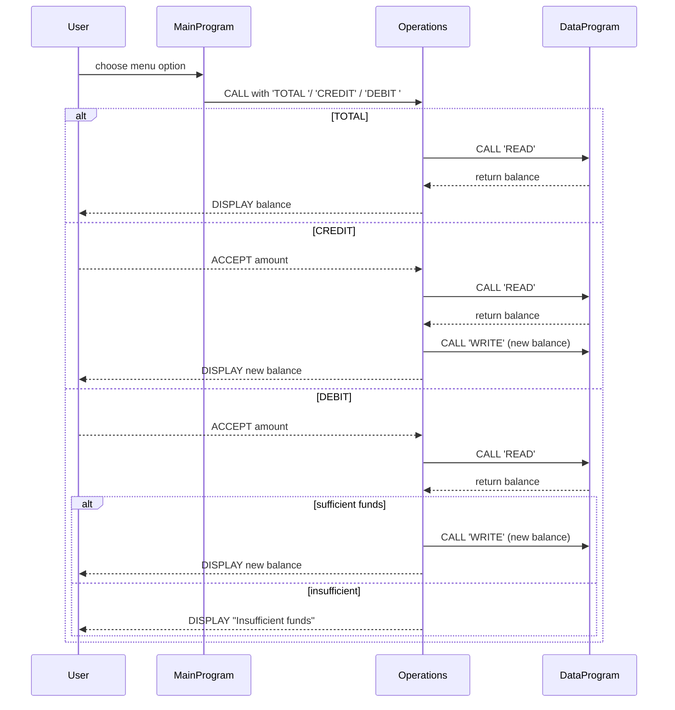

# Legacy COBOL Student Account System

This directory contains documentation for the COBOL files in `src/cobol` that implement a simplified
student account management system.  The programs demonstrate basic COBOL concepts such as
divisions, working-storage, linkage sections and CALL/GOBACK interactions.

## File Overview

### `main.cob` (MainProgram)

- Acts as the user interface and the entry point of the application.
- Displays a menu with choices to view balance, credit an account, debit an account, or exit.
- Continuously loops until the user selects the exit option.
- Uses the `CALL` verb to invoke `Operations` with appropriate operation codes.
- Contains the only business rule about exiting: setting `CONTINUE-FLAG` to `NO` when choice 4
  is selected.

### `operations.cob` (Operations)

- Receives a six-character operation code via the linkage section.
- Recognises three operations:
  - `TOTAL `: read and display the current balance.
  - `CREDIT`: prompt for a credit amount and add it to the balance.
  - `DEBIT `: prompt for a debit amount and subtract it from the balance provided
    sufficient funds exist.
- Delegates data storage of the balance to `DataProgram` by calling it with `READ` or `WRITE`.
- Implements the business rule preventing a debit if the requested amount exceeds the balance, showing
  an "Insufficient funds" message in that case.
- Keeps a `FINAL-BALANCE` working-storage field initialized to 1000.00 (the starting student account balance).

### `data.cob` (DataProgram)

- Encapsulates the logic for storing and retrieving the account balance.
- Maintains a working-storage variable `STORAGE-BALANCE` which simulates persistent storage
  with an initial value of 1000.00.
- Offers two operations via the linkage section:
  - `READ`: move `STORAGE-BALANCE` into the passed `BALANCE` parameter.
  - `WRITE`: update `STORAGE-BALANCE` with the provided `BALANCE` parameter.
- This modular design allows other programs to call `DataProgram` without needing direct access to
  the storage variable.

## Key Business Rules

1. **Initial Balance**: Every student account starts with a balance of `1000.00`.
2. **Read/Write Separation**: Balance access is always mediated through `DataProgram` using explicit
   `READ` and `WRITE` operations.
3. **Credit Operation**: Any positive amount entered by the user is added to the current balance.
4. **Debit Operation**:
   - The user may only debit if the requested amount is less than or equal to the current balance.
   - If the amount exceeds the balance, the operation is rejected and a warning message is displayed.
5. **Menus and Choices**: The user-facing menu enforces valid choices (1–4) and loops until exit.

> **Note:** Although these programs use hard-coded values and simple `DISPLAY/ACCEPT` I/O for
> illustration, they represent a textbook example of dividing responsibilities across multiple
> COBOL programs and enforcing basic rules for student account transactions.

## Getting Started

1. Compile each COBOL source file with your preferred COBOL compiler.
2. Link the programs so that `MainProgram` can CALL `Operations` and `Operations` can CALL `DataProgram`.
3. Execute `MainProgram` to interact with the menu and manage the simulated student account.

Feel free to expand the system by adding file-based persistence, authentication, or additional
business rules (e.g., transaction limits for student accounts).

---

## Sequence Diagram

Below is a Mermaid sequence diagram illustrating the data flow between the user interface and
the various COBOL programs.

